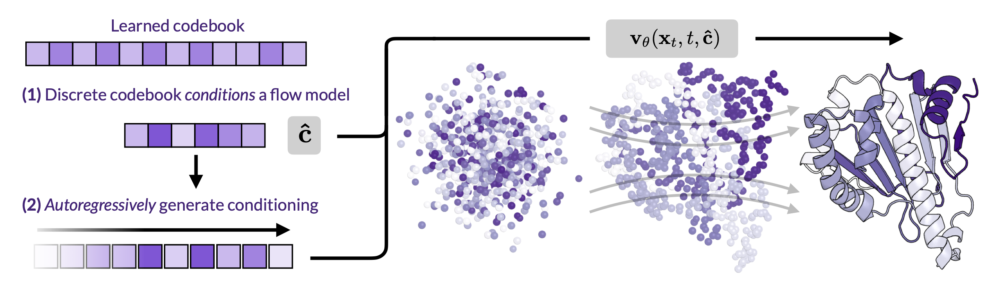

# Kanzi: Flow Autoencoders for Protein Tokenization
### [Paper](https://arxiv.org/pdf/2510.00351) | [](LICENSE) 


Kanzi is a family of discrete tokenizers for modeling biological structures.  
It is parameter-efficient (30M), fast to tokenize, and does not rely on complex SE(3)-invariant architectures.


---

## Installation

```bash
pip install .
```

or with [uv](https://github.com/astral-sh/uv):

```bash
uv pip install -e .
```
---

## Quick Start

First, [download a pretrained Kanzi checkpoint](https://drive.google.com/uc?export=download&id=1ZOcqJ9E3aC-m6letqXR3iruNBMzMKAEm)


```python
from kanzi import DAE, kabsch_rmsd
import fastpdb
import torch

device = "cuda:0"
model = DAE.from_pretrained("checkpoints/cleaned_model.pt").to(device).eval()

# Load PDB data
arr = fastpdb.PDBFile.read("pdbs/3bg1B01.pdb").get_structure(model=1)
arr = arr[arr.atom_name == "CA"].coord.reshape(1, -1, 3)
arr = torch.from_numpy(arr).to(device)

with torch.no_grad():
    *_, idx = model.encode(arr, preprocess=True)
    recon = model.decode(idx)

# Multiply by 10 to convert from Å to nm
print("Reconstruction error:", kabsch_rmsd(recon.cpu() * 10, arr.cpu()))
```

---

## Usage Notes

- Kanzi’s `encode` and `decode` operate in **nanometers**. If you read coordinates from a PDB file (typically in Å), **divide by 10**.  
- Inputs must be **zero-centered**. You can use `preprocess=True` in `model.encode()` to handle both centering and unit conversion.  
- **Batch encoding** is not yet supported.  
- Current release provides **Cα-only tokenizers** (full backbone support coming soon).

---

## Encoding

The encoder is a shallow transformer with sliding-window attention, making it both efficient and fast. The main point to be aware of is the encoding requires coordinates to be expressed in angstroms and mean centered. The following snippet describes what you need for a valid input.

```python
coords = torch.randn(1, 100, 3)  # fake Cα-only data
coords = (coords - coords.mean(dim=-2, keepdim=True)) / 10.0
```

---

## Decoding

`model.decode()` accepts two key parameters:

- `noise_weight`  
- `score_weight` (recommended: `1.0`)

Adjusting `score_weight` controls exploration by increasing the noise scale in the SDE sampler.  

⚠️ **Important:** Some models are not trained with classifier-free guidance. In those cases, setting `cfg_weight != 1` will lead to very poor reconstructions.

---

## Generation

Coming soon!

---

## Training

Coming soon! In the interim, we use the standard AFDB-Foldseek clustered dataset with all proteins smaller than 256 residues. 

---

## Citation

Kanzi uses code from several other packages, notably [Proteina](https://github.com/NVIDIA-Digital-Bio/proteina) and [torchCFM](https://github.com/atong01/conditional-flow-matching). 

If you use **Kanzi**, please cite:

```
@article{kanzi2025,
  title   = {Kanzi: Flow Autoencoders are Effective Protein Tokenizers},
  author  = {Rohit Dilip, Evan Zhang, Ayush Varshney, David Van Valen},
  journal = {arXiv preprint arxiv:2510.00351},
  year    = {2025},
}
```
